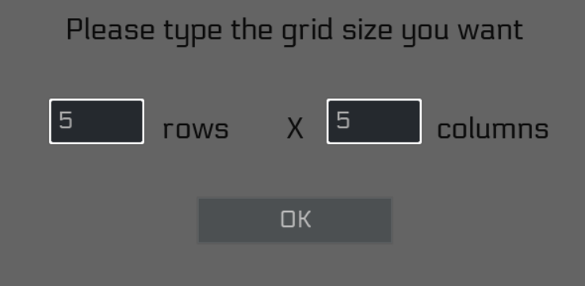
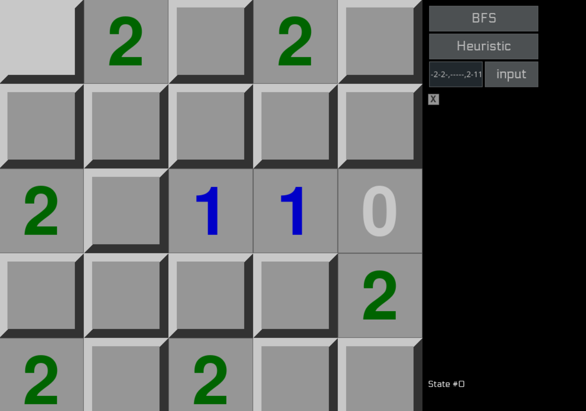
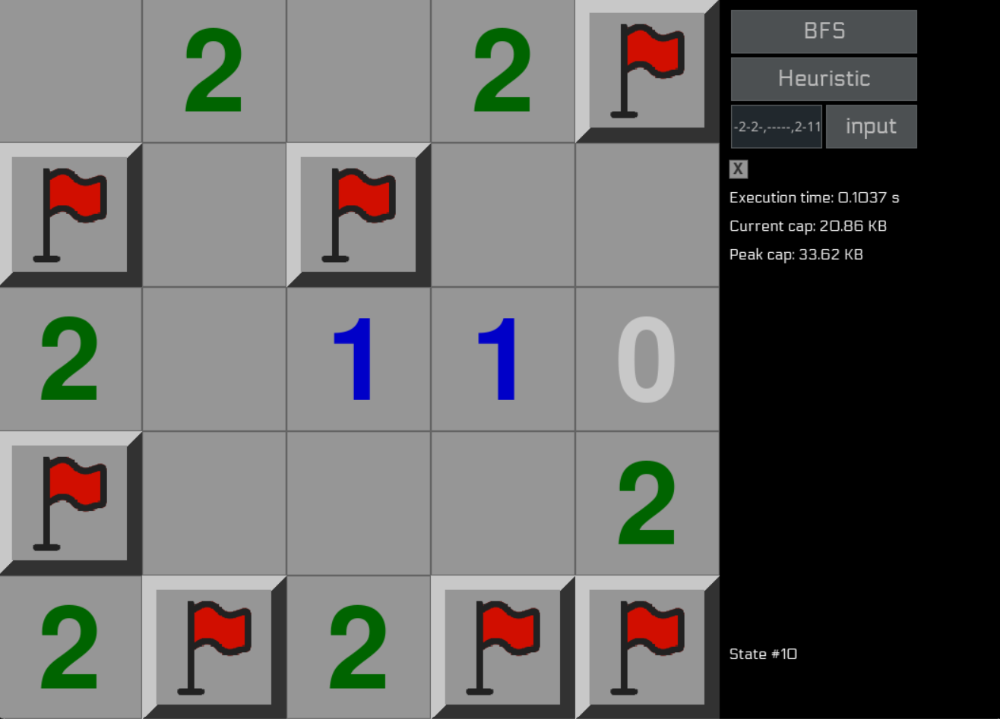

# **Simple AI for minesweeper game** 
[Link original game](https://www.puzzle-minesweeper.com/)
## Built with Pygame and search algorithms (BFS, Hill climbing)
## Example:
- Run main.py
- Input grid size: 5 5 (row and column)
- OK

- Input grid data: -2-2-,-----,2-110,----2,2-2-- (then press input or change cell data by clicking left/right mouse button)
- Click checkbox to show animation (optional)

- Select solving method: BFS/Heuristic(Hill climbing)

- Input empty then press input to reset grid